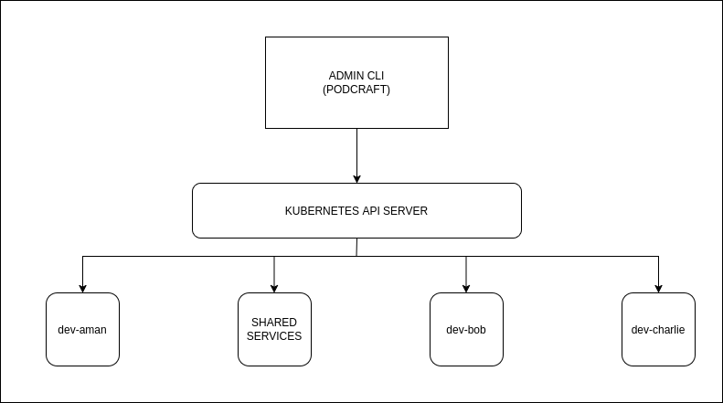
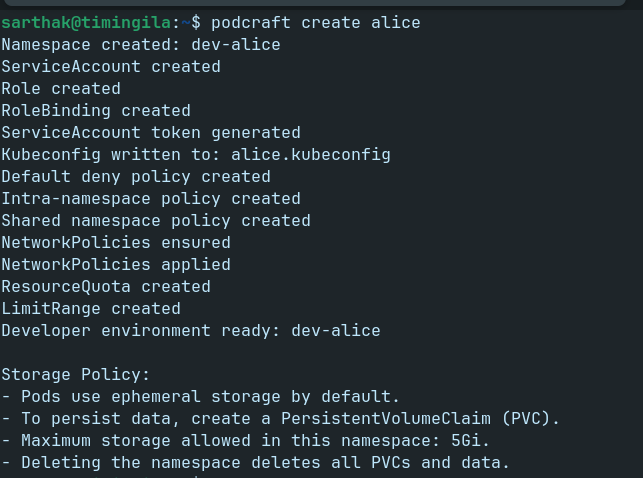
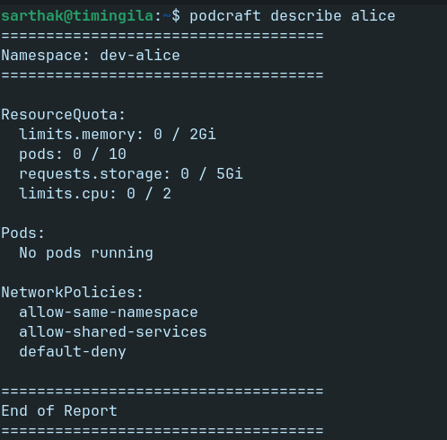
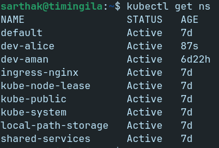
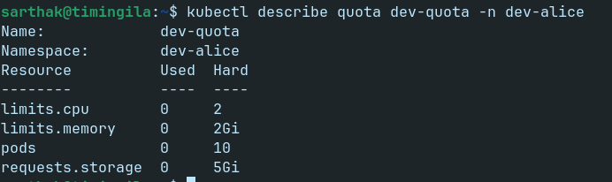
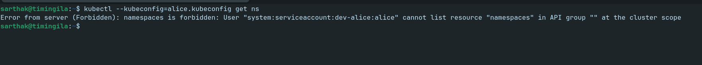
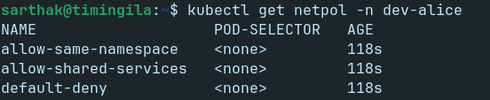

# PodCraft

PodCraft is a lightweight, infra-agnostic Kubernetes Internal Developer Platform (IDP) built in Go.

It provisions isolated, resource-governed, zero-trust namespaces for developers using native Kubernetes APIs - no YAML templating, no Helm dependency, no infrastructure assumptions.

---

## What Problem Does PodCraft Solve?

In multi-tenant Kubernetes clusters:

- Developers need isolated environments
- Admins need resource governance
- Network boundaries must be enforced
- Storage must be controlled
- Manual namespace setup is repetitive and error-prone

PodCraft automates namespace provisioning with:

- RBAC isolation
- Zero-trust network policies
- Resource quotas
- Limit ranges
- Optional persistent storage
- Developer-specific kubeconfig generation

---

## Architecture Overview

PodCraft follows a namespace-per-developer model:

```
dev-aman
dev-bailey
dev-charlie
```

Each namespace gets:

- ServiceAccount
- Role + RoleBinding
- NetworkPolicies
- ResourceQuota
- LimitRange
- Storage quota
- Developer kubeconfig

The admin runs PodCraft.
Developers receive restricted kubeconfig files.

<p align="center">
  
</p>


---

## Features

### Multi-Tenant Isolation
- Namespace-level isolation
- ServiceAccount-scoped access
- Developers cannot access other namespaces
- Quotas and policies cannot be modified by developers

### Zero-Trust Networking
- Default deny ingress policy
- Allow intra-namespace traffic
- Allow access to shared-services namespace
- Block cross-developer communication

### Resource Governance
- Configurable CPU, memory, and pod limits
- Enforced via ResourceQuota
- Per-container defaults via LimitRange

### Storage Model
- Pods use ephemeral storage by default
- Developers may create PVCs explicitly
- Storage limited via namespace quota (5Gi by default)
- No infrastructure-specific storage assumptions

### Idempotent Reconciliation
- Safe to re-run `create`
- Detects and corrects drift
- Updates quotas if changed

### Developer Access
- Generates per-developer kubeconfig
- Token-based authentication (TokenRequest API)
- Namespace-scoped access only

---

## Installation

Directly download via Go-install

```
go install github.com/sarthakK31/podcraft@latest
```

OR

Clone repository:

```
git clone https://github.com/sarthakK31/podcraft.git
cd podcraft
```

Build:

```bash
go build -o podcraft
```

---

## Requirements

- Kubernetes cluster (kind, kubeadm, EKS, GKE, AKS, etc.)
- kubectl configured
- Go 1.22+
- At least one default StorageClass (for PVC support)

PodCraft is cluster-agnostic and does not assume:

- Cloud provider
- hostPort
- NodePort
- Specific CNI
- Specific CSI driver

---

## Usage

### Create Developer Environment

```
podcraft create aman
```

With custom limits:

```
podcraft create aman \
  --cpu=4 \
  --memory=4Gi \
  --max-pods=20
```

This creates:

```
dev-aman namespace
aman ServiceAccount
RBAC rules
NetworkPolicies
ResourceQuota
LimitRange
aman.kubeconfig
```


---

### Delete Developer Environment

```
podcraft delete aman
```

Deletes the namespace and all associated resources.

---

### Describe Developer Namespace

```
podcraft describe aman
```

Displays:

- Quota usage
- Pods
- NetworkPolicies



---

## Developer Workflow

After admin runs:

```
podcraft create aman
```

Developer receives:

```
aman.kubeconfig
```

Developer uses:

```
kubectl --kubeconfig=aman.kubeconfig get pods
```

They can:

- Deploy applications
- Create services
- Create PVCs (within storage quota)

They cannot:

- Access other namespaces
- Modify quotas
- Modify RBAC
- Modify network policies

In the snapshots below, you can see how the namespace is created, the dev kubeconfig can not see other namespaces, quotas, limits and network policies are also created.  


<p align="center">
  
  &nbsp; &nbsp; &nbsp;
  
  &nbsp; &nbsp; &nbsp;
  
  &nbsp; &nbsp; &nbsp;
  
</p>

---

## Persistent Storage

By default, workloads are ephemeral.

To persist data:

```
apiVersion: v1
kind: PersistentVolumeClaim
metadata:
  name: mydata
spec:
  accessModes:
    - ReadWriteOnce
  resources:
    requests:
      storage: 1Gi
```

Storage quota per namespace: **5Gi**. 

If exceeded, PVC creation fails.

If you need a different limit, feel free to modify the limit in the code. For now its hardcoded.

---

## Security Model

PodCraft enforces:

- Least privilege RBAC
- Namespace isolation
- Default deny networking
- Shared-services allowlist
- Resource quotas
- Storage limits

It follows a zero-trust namespace boundary model.

---

## Internal Structure

```
cmd/
  create.go
  delete.go
  describe.go
  list.go
  root.go
  version.go

pkg/
  kube/
  namespace/
  rbac/
  network/
  quota/
  kubeconfig/
```

Modular, reconciler-style architecture.

---

## Roadmap

- TTL-based namespace expiration
- Usage metrics integration
- Egress network policies
- Helm integration
- Release binaries
- Structured logging
- Unit tests

---

## Why PodCraft?

PodCraft demonstrates:

- Kubernetes API-driven automation
- Multi-tenant platform engineering
- Declarative reconciliation patterns
- Infra-agnostic design
- Security-first namespace provisioning

It is a lightweight alternative for internal developer sandbox provisioning.

---

## License

This project is licensed under the MIT License.
---

Built with ❤️ using client-go and Cobra.
